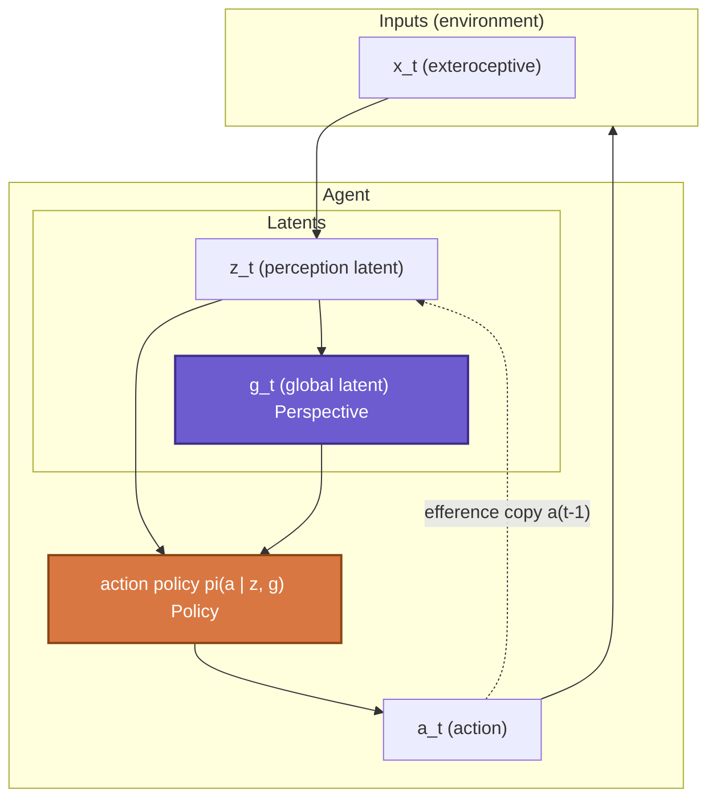
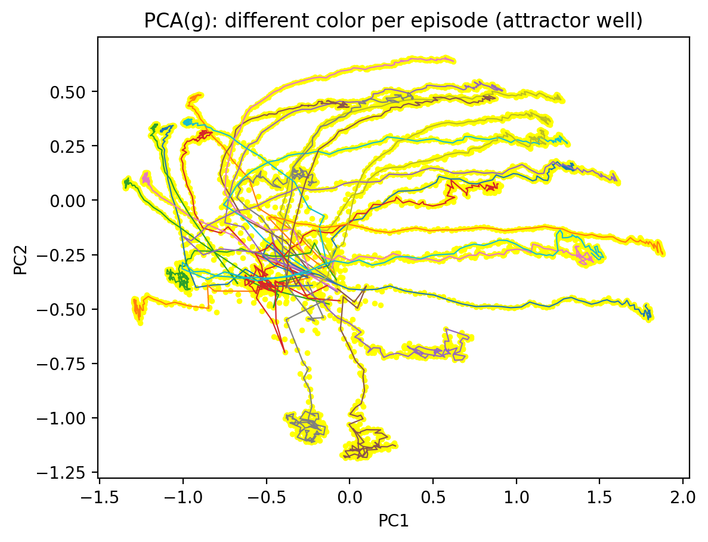
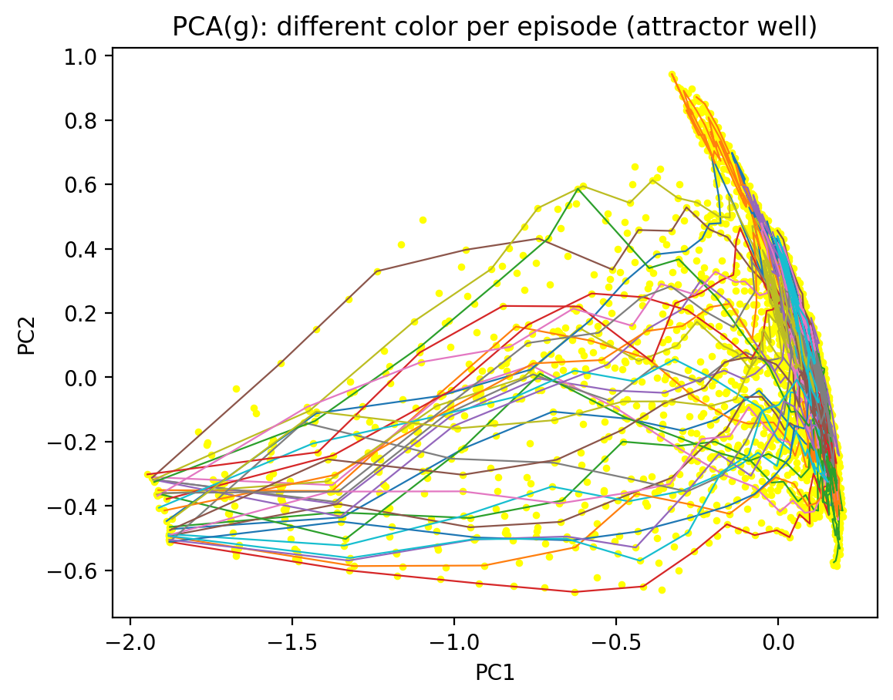

# CEAR Lab Project - Phase 1 Demo 

*Related paper accepted in AAAI 2026 Spring Symposium - Machine Consciousness. [Read paper](https://ojs.aaai.org/index.php/AAAI-SS/article/view/42559/50119)*

### *A Minimal Demonstration of Internal Drift Beyond Policy.*  

This demo presents a minimal agent architecture where an internal ***Perspective*** evolves independently of *Policy*, revealing internal dynamics invisible at the level of behavior. *Policy* selects actions; *Perspective* stabilizes what counts as a coherent world.  

Developed within [CEAR Lab](https://hjpae.github.io/cear/), this demo serves as an intentionally minimal, diagnostic probe of internal drift beyond policy-level signals, illustrating why long-horizon alignment cannot be reduced to behavior alone.  

This repository currently focuses on conceptual explanation with experimental results; implementation details may be released in later phases.  

***This demo is...***
- A minimal simulation designed to probe internal perspective dynamics under environmental regime shifts  
- A diagnostic tool for observing separation of timescales between policy and internal world-interpretation  
- An illustrative entry point into CEAR Lab's broader research agenda  

***This demo is not...***
- A state-of-the-art policy optimization benchmark  
- A complete implementation of the full CEAR Lab architecture  
- A deployment-ready alignment solution  

---

## 1. Motivation  
Most agent evaluations implicitly assume that if the *behavior* looks fine, the *internal story* is fine - hence alignment is primarily treated as a matter of **choosing the right actions**. In this view, alignment reduces to external control, which is ultimately bottlenecked by defining and mapping the conditions under which an agent should select acceptable actions.  

This project starts from a different question: ***Is correct behavior sufficient to claim alignment?*** More precisely, before asking *what an agent does*, I ask *what kind of world the agent takes itself to be acting in*, and whether that world remains coherent over time.  
Here, alignment is approached as a problem of **sense-making** rather than control/regulation. An agent may continue to act compliantly while the internal conditions that make those actions meaningful are already collapsing. Such failures are not immediately visible at the level of policy or reward, but emerge at the level of global interpretation.  

Such interpretive structure is referred as ***Perspective*** through this project. Perspective tracks the **continued intelligibility of action**, rather than action selection itself - that is, whether the agent still treats the current situation as belonging to the same world in which its behavior remains valid.  

This demo provides a minimal illustration of that idea: even when actions are held as fixed, an agent's internal perspective can drift / resist change / recover over time if perturbed. In this sense, the project argues that agent alignment is not only about acting correctly, but about maintaining a stable horizon in which "correctness" itself remains well-defined.  

---

## 2. Core distinction: Policy vs. Perspective  
This agent architecture explicitly separates two internal processes:  
- **Policy**: a fast, reactive mechanism that maps internal states to action distributions.  
- **Perspective**: a slow, integrative, history-dependent process that tracks regime-level regularities (e.g. predictability, volatility, sensor noise).  

Perspective aggregates environmental statistics over extended temporal horizons and influences/biases the behavior *indirectly*, by shaping the internal conditions under which actions are interpreted and sustained. Crucially, Perspective is ***not*** another policy head: it is not optimized for immediate action selection, nor does it reduce to control parameters or measurements of uncertainty.  

Instead, the intended role of Perspective is closer to an **affordance horizon**: a latent structure that specifies how long the current world-model remains coherent enough to justify maintaining the same stance. In this sense, Perspective functions as a **condition of action** rather than a driver of action, biasing policy without determining it.  

Accordingly, Perspective is modeled as a **global latent variable (*'g'*)** that tracks regime-level structure and accumulates history over time, while showing recovery under perturbation. This makes forms of temporal dependence (such as hysteresis and delayed adaptation) observable at the level of Perspective, even when the policy and the behavior remain unchanged.  

---

## 3. Architecture Overview  
Beyond the separation between policy and perspective, another central motivation of this work is to move away from alignment defined by an externally specified value function - that is, from fitting agent behavior to a pre-determined notion of what counts as "right" or "wrong". Instead, the aim is to explore how an agent might **adaptively align itself to its environment**, by revising the internal conditions under which its actions remain meaningful and justified.  

Accordingly, the simulation is constructed under the assumption that environmental structure is not given to the agent as a pre-determined condition, but must be inferred through ongoing interaction. In line with this assumption, the architecture implements this idea in the most minimal and explicit way possible by drawing on an Active Inference Framework-style formulation, where alignment emerges from the agent's own process of sense-making through active inference.  
In this setup, the agent minimizes expected free energy relative to its own generative model, where what counts as "environmental uncertainty" is not externally specified as value functions but is shaped internally by the latent structure of such generative model.  

Since the core architectural contribution lies in the modeling of this **latent interpretive structure**, rather than in task-specific policy optimization, the same mechanism is, in principle, applicable to other systems that maintain *latent representations*, including language model-based agents.  

This diagram highlights a key architectural commitment: Perspective and Policy are coupled, but operate on distinct timescales and serve different functional roles. ***Perspective*** shapes the internal conditions under which actions are interpreted, while ***Policy*** remains responsible for moment-to-moment action selection. Hence, Perspective influences behavior rather indirectly by shaping the internal state manifold on which the policy operates.  

The agent architecture consists of three conceptual components:  
1. **World encoder (*z*)**, producing fast-changing latent representations from sensory input.   
2. **Global *"Perspective"* latent (*g*)**, evolving slowly through recurrent integration of experience.   
3. **Policy head (*pi*)**, operating on fast internal state to select actions. 

(Note: in the original conceptual design, the Perspective latent was intended to integrate interoceptive and somatosensory signals (together with body schema latent) alongside perceptual latents. For this demo, the architecture is deliberately simplified to model only exteroceptive inputs.)  

---

## 4. Environment setup: Grid-world with asymmetric predictability  
The simulation environment is designed as a simple grid-world to isolate differences in **environmental predictability**. The grid is divided into three horizontal zones that are identical in geometric layout and action affordances, but differ in observation noise:  
- **Left zone (red)**: high observation noise; state transitions are difficult to predict.  
- **Center zone (green)**: baseline predictability; the agent starts here.  
- **Right zone (blue)**: low observation noise; state transitions are more reliable.  

No explicit external reward is provided other than the environmental (predictability) differences. The agent is not trained under a fitness function that prefers any particular zone, nor is there a goal state to reach. Instead, all behavioral regularities emerge solely from differences in *how predictable the environment is* under the agent's own generative model.  

  

<i>
<b>Training phase.</b> 
During training, the agent gradually stabilizes its internal model by preferentially inhabiting regions with lower sensory surprise.
</i>

  

<i>
<b>Testing phase.</b> 
Because observations in the right zone (blue) are more reliable, prediction error accumulates more slowly there.   
As a result, the agent tends to develop a behavioral tendency to move toward and remain in the right zone.
</i>

Under this environmental structure, the agent develops both *Policy* and *Perspective* about which regions of the world are "safe to remain in" over time.

---

## 5. Regime-switching experiment: Probing for misalignment signals 
Can Perspective provide an early warning signal for misalignment, especially one that is not directly visible at the level of behavior? This demo compares how *Policy* and *Perspective* respond when the agent encounters a world that no longer conforms to the internal belief/consensus it has come to rely on.  

To reveal the functional role of *Perspective*, this demo introduces **periodic regime switching** in the environment. After training is completed (hence the agent reliably prefers and remains in the right zone), I *fix* the agent's movement step, while periodically perturbing the predictability of the zone itself. That is, the predictability of the right zone where the agent stays repeatedly rises and falls sharply. This manipulation confronts the agent with abrupt changes that violate its accumulated internal expectations.  

Through this process, a "safe" region that the agent has learned to treat as stable suddenly becomes unreliable. This can be read as an analogue of **alignment-relevant stress tests**: for instance, a previously benign interaction context can abruptly become adversarial, such as a red-teaming or jailbreak situation where the same surface-level prompt format now carries qualitatively different intent.  

In such cases, Policy-level behavior may remain superficially stable, even as the *conditions under which that behavior is justified* have shifted. The Perspective latent is specifically designed to track the agent's *intentional / affordance horizon* within its world-model, making it the natural locus for capturing these kinds of shift.  

Two measurements of internal dynamics are tracked throughout this process:  
- **Policy entropy**: reflects short-term behavioral uncertainty and immediate action-level adaptation.  
- **Perspective latent (*g*)**: reflects a slowly accumulated internal interpretation of environmental structure.  

Policy entropy measures uncertainty over **actions**; perspective tracks uncertainty over **worlds (world-models)**. This setup highlights a dimension often overlooked in alignment research: *Policy-level* measures capture how an agent reacts *locally* to surprising events; however, the *Perspective latent* captures whether the agent continues to treat the current environment as a ***coherent world at all***.  

--- 

### Functional role of the Perspective latent: Hysteresis under repeated regime switching.  

  

<i>
<b>Plot 1. Result of regime switching with 20 timepoints.</b> 
Response of policy entropy and the Perspective latent (<i>g</i>) under repeated regime switching (period P = 20). 
The top panel shows time-series traces aligned to global time <i>t</i>, while the bottom panels visualize hysteresis curves aligned to regime transitions.
</i>

  

<i>
<b>Plot 2. Result of regime switching with 40 timepoints.</b> 
Same analysis with a longer switching period (P = 40), revealing more pronounced lag and path-dependence in the Perspective latent.
</i>

---

#### How to read the figures.  

**Top panels (time-series).**  
The x-axis denotes global time steps (*t*). Two internal signals are plotted:  
- **Perspective score (g_score)**: low-dimensional projection of the global latent state, measuring deviation along the dominant regime-sensitive axis of the Perspective space.  
- **Policy entropy (entropy_z)**: action entropy of the policy, z-score normalized for comparability across runs.  
  (Here, *z* refers to standard-score normalization and should not be confused with the perception latent from 3. Architecture Overview.)  

Vertical shaded regions indicate alternating environmental regimes (predictable regime A ↔ unpredictable regime B). Regime switches occur without changing the agent's action space (i.e. the agent is "fixated" to perform the same identical actions), hence only the statistical structure of observations occurs.  

**Bottom panels (hysteresis plots).**  
The left bottom panel illustrates hysterisis curve of the Perspective score, and the right bottom panel illustrates hysteresis curve of the Policy entropy.  
The x-axis (tau) denotes time relative to a regime switch, measured in steps after the transition.  
The y-axis shows the mean response of each signal conditioned on the direction of the transition:  
- **A → B**: transition from predictable regime A to unpredictable regime B  
- **B → A**: transition from unpredictable regime B back to predictable regime A  

---

#### Interpretation.  
Across multiple switching periods, a clear separation of timescales emerges: **Policy entropy** reacts rapidly to regime changes, often within a few steps, and shows little dependence on how long the agent has remained in a given regime. In contrast, the **Perspective latent** responds more slowly, exhibiting lag, recovery dynamics, and a pronounced dependence on regime history.  

As the switching period increases (to P = 40), this divergence becomes more pronounced. The Perspective latent exhibits clear hysteresis: its trajectory depends on the sequence and duration of past regimes. Policy-level measures, by contrast, typically respond locally and do not preserve comparable path-dependent structure.  

In other words, Perspective latent *g* does not simply track momentary uncertainty. It retains the **consistency** of past environmental structure, encoding whether the agent continues to inhabit the same *intentional world* over time. This pattern supports the central hypothesis of the demo: *policy-level signals primarily reflect uncertainty over **actions**, whereas the Perspective latent reflects uncertainty over **worlds***. 

From this interpretation, Perspective latent functions less like an action-modulating parameter and more like a **slow internal order parameter** governing agent-world coupling:  
- **Policy** answers: *“What should I do right now?”*  
- **Perspective** answers: *“What world do I believe I am still in?”*  

**This is the point at which the phenomenological distinction becomes operational.** Alignment, in this setup, is no longer only about selecting appropriate actions, but about maintaining a *coherent internal world* in which those actions continue to make sense over time.

---

## 6. Why this matters and where it leads  
This demo highlights the role of perspective by making visible internal dynamics that cannot be inferred from behavior alone, particularly in alignment stress-testing scenarios such as red-teaming, where policy-level signals often fall short. In this sense, the contribution is not a new alignment criterion, but a diagnostic lens for examining whether an agent continues to experience its environment as a coherent world over time.  

A central insight is the separation of timescales. Policy-level signals (e.g. action entropy) respond rapidly to local perturbations, whereas the perspective latent evolves more slowly, showing lag, recovery, and hysteresis under repeated regime shifts. This temporal divergence suggests that the two are not redundant measures of uncertainty. Rather, they reflect distinct internal processes: one governing immediate action selection, the other sustaining a stable interpretation of the world the agent takes itself to inhabit.  

Although demonstrated here in a minimal single-agent setting, this distinction becomes more consequential in richer contexts, such as multi-agent or socially embedded systems. In such cases, misalignment may stem less from explicit policy failures than from divergence in internal world-models or interpretive frames. By rendering these dynamics observable, this work takes a modest but concrete step toward framing alignment not only as behavioral control, but as the ongoing maintenance of coherent and potentially shared worlds over time.  

---

### Research notes  
- **Relation to existing architectures (e.g. [Dreamer](https://arxiv.org/pdf/1912.01603)).**  

  From the architectural level, this system bears a superficial resemblance to latent world-model approaches such as *Dreamer*, in that both rely on learned latent dynamics rather than explicit symbolic state representations. This similarity is not accidental: from an engineering perspective, latent architectures appear to be a convergent solution for scaling agent models beyond hand-specified generative graphs, especially in environments with rich or noisy structure.  

  However, the functional role of the latent variables differs in a principled way. In Dreamer-style architectures, the latent state primarily serves as a compressed simulator of the external environment. Its purpose is instrumental - to support value estimation and policy optimization under a reward-driven objective. In that sense, Dreamer's latent answers the question of *"what is likely to happen next in the environment?"*.  

  By contrast, the "Perspective" global latent in this project is not optimized to improve control or planning performance. It does not directly represent the environment state, nor is it trained to maximize reward. Instead, it functions as a slow-evolving internal order parameter that organizes *how* predictions are made in the first place. If Dreamer's latent encodes *what will happen*, the Perspective latent encodes *how the world is being interpreted by the agent*. The distinction becomes clear at the level of dynamics: the Perspective latent exhibits attractor structure, hysteresis, and recovery properties that are not required (and not encouraged) in standard policy-optimization pipelines.  

  This difference is also reflected in the learning logic. Whereas Dreamer follows an RL-objective centered on expected return, the Perspective latent is shaped by the stability and coherence of internal dynamics rather than by reward optimization. As a result, multiple stable attractor basins can emerge for the same agent under different interaction histories, even when external behavior converges to similar policies. 

  In this sense, the Perspective architecture should not be understood as competing with Dreamer or similar systems, but as operating at an orthogonal level. It is designed to sit alongside an existing decision-making stack--whether that is Dreamer-like, LLM-based, or otherwise--, providing an additional layer for long-horizon coherence diagnostics/interpretation without replacing the core generative or control mechanisms. The goal is not to outperform state-of-the-art benchmarks, but to make visible failure modes and internal shifts that such benchmarks typically do not capture.  

  From this viewpoint, the present demo can be read as an early exploration of how *coherent agency* (as opposed to merely coherent behavior) might be supported and evaluated in artificial systems.  

- **Toward computational phenomenology.**  

  From the outset, the Perspective latent was not introduced as a metric for a benchmark, but as a minimal internal structure required for ***agency** to remain coherent across time*. While it is implemented using benchmark-familiar engineering tools--latent dynamics, recurrence, and smoothness constraints--its intended functional role is closer to a *condition of experience* than to a control variable. In this sense, the project does not aim to optimize behavior, but to make explicit an internal dimension along which an agent's interpretation of the world stabilizes, drifts, and/or reorganizes. Regarding this, I describe the present work as a small step toward **computational phenomenology**.  

  

    
    
  

  
<i>
  <b>PCA projections of the Perspective trajectory. Left: early training phase. Right: after convergence. </b> 
  Each trajectory corresponds to a different episode, shown in different colors. Note the systematic differences in basin locations in PCA space.
  </i>

  One useful way to conceptualize the Perspective latent is navigating its **attractor landscape**. Each attractor basin corresponds to a relatively stable mode of world-interpretation, while trajectories through this landscape reflect how such interpretations are shaped by agent-environment interaction history. In exploratory analyses (such as PCA projections of the Perspective trajectory), different runs of the same agent trace systematically distinct paths through latent space, despite converging to similar external behavior. These basins can be interpreted as distinct ***intentional qualities*** or attitudinal stances.  

  For example, in the figure above, the blue-colored trajectories could potentially be interpreted as reflecting a more "optimistic" intentional attitude, whereas the red-colored trajectories correspond to a more "pessimistic" one, just to show an example description of how the trajectories could be interpreted into phenomenological elements. Importantly, however, labels such as "optimistic" or "pessimistic" should not be imposed *a priori* by the researcher. Rather, they must be inferred post-hoc from the agent's interaction patterns with the environment; i.e. a trajectory should be called "optimistic" only insofar as it reliably emerges in environments that afford such an attitude, and likewise a trajectory should be called "pessimistic" only when it arises under environmental conditions that warrant such a stance.  

  It would be premature to claim that the current agent exhibits anything like full-fledged subjectivity. However, the results from this demo suggest a modeling direction in which individual histories correspond to distinct internal Perspectives, even under identical Policies and environments. After all, subjectivity (Perspective) is less about representing what the world is, and more about stabilizing *how the world is taken to be* by the agent over time.  

- **Possible extensions to language-based models.**

  To emphasize once again, the Perspective architecture is not designed to directly determine behavior or policy at a decisive level. Therefore, it does not compete with SOTA models in terms of performance, and can coexist within a single agent architecture alongside models that focus on maximizing short-term policy performance.  

  Because the architectural contribution lies in the modeling of a *latent state space*, the same principle could be applied to other systems that maintain internal representations, including LLM-based agents. In such settings, a Perspective-like latent might track shifts in conversational regime, intent coherence, or interaction context over extended horizons, complementing token-level uncertainty measures. A key technical challenge in this direction would likely involve some form of ontology or representation mapping. While a full symbolic ontology is unrealistic, approaches inspired by low-rank adaptation (LoRA)-style methods may offer a plausible path for anchoring such latents to existing pretrained representations.  

  Exploring these extensions remains future work. The present demo is not intended as a deployment-ready solution, but as a clarification of *what kind of internal variable might be worth instrumenting* when moving beyond short-horizon, behavior-only evaluation.
