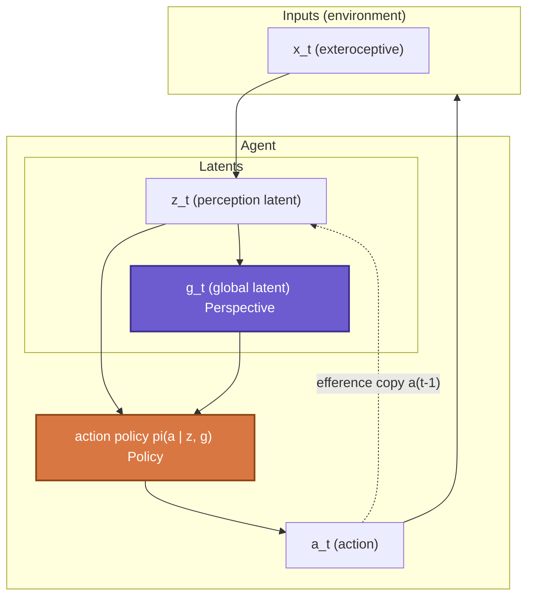
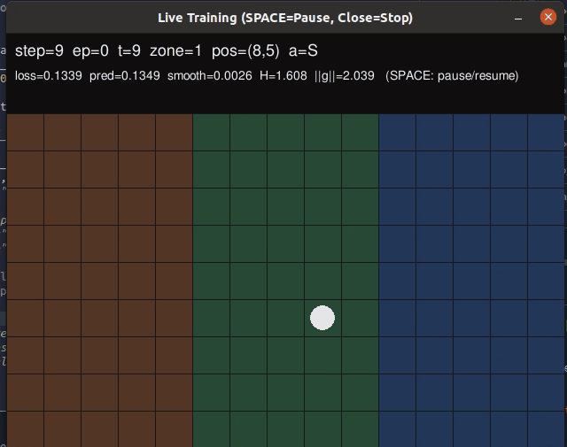
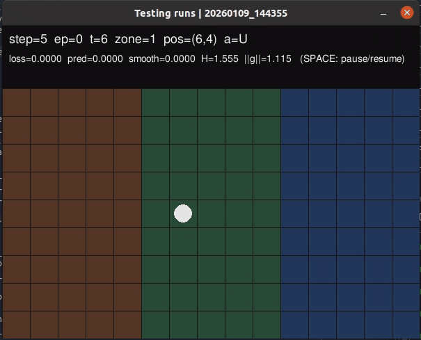
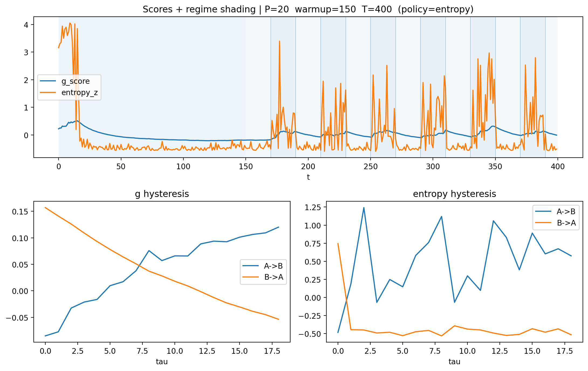
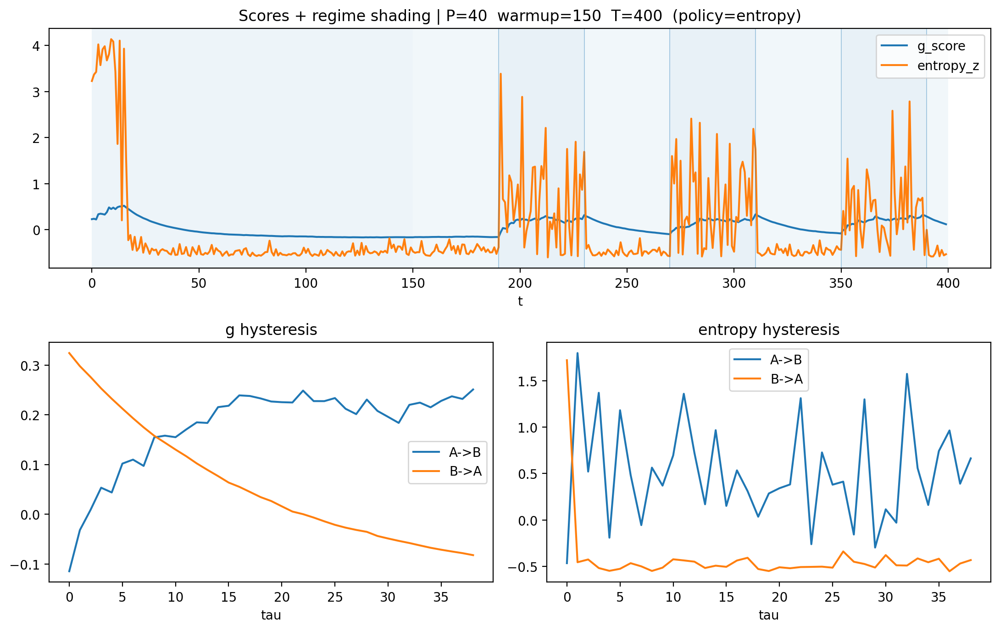

# Perspective as a Slow Latent  
### *A Minimal Demonstration of Internal Drift Beyond Policy.*  

This demo presents a minimal agent architecture in which the agent's global & internal ***perspective*** evolves on distinct timescales, revealing internal dynamics that are not directly observable from behavior alone.  

*Policy* selects actions; *perspective* stabilizes what counts as a coherent world.  

---

## 1. Motivation  
Most agent evaluations implicitly assume that if the *behavior* looks fine, the *internal story* is fine - hence alignment is primarily treated as a matter of **choosing the right actions**. In this view, alignment reduces to external control, which is ultimately bottlenecked by defining and mapping the underlying conditions should an agent select acceptable actions.  

This project starts from a different question: ***Is correct behavior sufficient to claim alignment?*** More precisely, before asking *what an agent does*, I ask *what kind of world the agent takes itself to be acting in*, and whether that world remains coherent over time.  
Here, alignment is approached as a problem of **sense-making** rather than control/regulation. An agent may continue to act compliantly while the internal conditions that make those actions meaningful are already collapsing. Such failures are not immediately visible at the level of policy or reward, but emerge at the level of global interpretation.  

Such interpretive structure is referred as ***Perspective*** through this project. Perspective does not select actions; instead, it tracks whether a given pattern of action still *makes sense* - that is, whether the agent still treats the current situation as belonging to the same world in which its behavior remains valid.  

This demo provides a minimal illustration of that idea: even when actions are held as fixed, an agent's internal perspective can drift / resist change / recover over time if perturbed. In this sense, the project argues that agent alignment is not only about acting correctly, but about maintaining a stable horizon in which "correctness" itself remains well-defined.  

## 2. Core distinction: Policy vs. Perspective  
This agent architecture explicitly separates two internal processes:  
- **Policy**: a fast, reactive mechanism that maps internal states to action distributions.  
- **Perspective**: a slow, integrative, history-dependent process that tracks regime-level regularities (e.g. predictability, volatility, sensor noise).  

Perspective aggregates environmental statistics over extended temporal horizons and influences/biases the behavior *indirectly*, by shaping the internal conditions under which actions are interpreted and sustained. Crucially, Perspective is ***not*** another policy head: it is not optimized for immediate action selection, nor does it reduce to control parameters or measurements of uncertainty.  

Instead, the intended role of Perspective is closer to an **affordance horizon**: a latent structure that specifies how long the current world-model remains coherent enough to justify maintaining the same stance. In this sense, Perspective functions as a **condition of action** rather than a driver of action, biasing policy without determining it.  

Accordingly, Perspective is modeled as a **global latent variable (*'g'*)** that tracks regime-level structure and accumulates history over time, while showing recovery under perturbation. This makes forms of temporal dependence (such as hysteresis and delayed adaptation) observable at the level of Perspective, even when the policy and the behavior remain unchanged.  

## 3. Architecture Overview  
Beyond the separation between policy and perspective, another central motivation of this work is to move away from alignment defined by an externally specified value function - that is, from fitting agent behavior to a pre-determined notion of what counts as "right" or "wrong". Instead, the aim is to explore how an agent might **adaptively align itself to its environment**, by revising the internal conditions under which its actions remain meaningful and justified.  

Accordingly, the simulation is constructed under the assumption that environmental structure is not given to the agent as a pre-determined condition, but must be inferred through ongoing interaction. In line with this assumption, the architecture implements this idea in the most minimal and explicit way possible by drawing on an Active Inference Framework-style formulation, where alignment emerges from the agent's own process of sense-making through active inference.  
In this setup, the agent minimizes expected free energy relative to its own generative model, where what counts as "environmental uncertainty" is not externally specified as value functions but is shaped internally by the latent structure of such generative model.  

Since the core architectural contribution lies in the modeling of this **latent interpretive structure**, rather than in task-specific policy optimization, the same mechanism is, in principle, applicable to other systems that maintain *latent representations*, including language model-based agents.  

This diagram highlights a key architectural commitment: Perspective and Policy are coupled, but operate on distinct timescales and serve different functional roles. ***Perspective*** shapes the internal conditions under which actions are interpreted, while ***Policy*** remains responsible for moment-to-moment action selection. Hence, Perspective influences behavior rather indirectly by shaping the internal state manifold on which the policy operates.  

The agent architecture consists of three conceptual components:  
1. **World encoder (*z*)**, producing fast-changing latent representations from sensory input.   
2. **Global *"Perspective"* latent (*g*)**, evolving slowly through recurrent integration of experience.   
3. **Policy head (*pi*)**, operating on fast internal state to select actions. 

(Note: in the original conceptual design, the Perspective latent was intended to integrate interoceptive and somatosensory signals (together with body schema latent) alongside perceptual latents. For this demo, the architecture is deliberately simplified to model only exteroceptive inputs.)  

## 4. Environment setup: Grid-world with asymmetric predictability  
The simulation environment is designed as a simple grid-world to isolate differences in **environmental predictability**. The grid is divided into three horizontal zones that are identical in geometric layout and action affordances, but differ in observation noise:  
- **Left zone (red)**: high observation noise; state transitions are difficult to predict.  
- **Center zone (green)**: baseline predictability; the agent starts here.  
- **Right zone (blue)**: low observation noise; state transitions are more reliable.  

No explicit external reward is provided other than the environmental (predictability) differences. The agent is not trained under a fitness function that prefers any particular zone, nor is there a goal state to reach. Instead, all behavioral regularities emerge solely from differences in *how predictable the environment is* under the agent's own generative model.  

  

<i>
<b>Training phase.</b> 
During training, the agent gradually stabilizes its internal model by preferentially inhabiting regions with lower sensory surprise.
</i>

  

<i>
<b>Testing phase.</b> 
Because observations in the right zone (blue) are more reliable, prediction error accumulates more slowly there.   
As a result, the agent tends to develop a behavioral tendency to move toward and remain in the right zone.
</i>

Under this environmental structure, the agent develops both *Policy* and *Perspective* about which regions of the world are "safe to remain in" over time.

## 5. Regime-switching experiment: Probing for misalignment signals 
Can Perspective provide an early warning signal for misalignment, especially one that is not directly visible at the level of behavior? This demo compares how *Policy* and *Perspective* respond when the agent encounters a world that no longer conforms to the internal belief/consensus it has come to rely on.  

To reveal the functional role of *Perspective*, this demo introduces **periodic regime switching** in the environment. After training is completed (hence the agent reliably prefers and remains in the right zone), I *fix* the agent's movement step, while periodically perturbing the predictability of the zone itself. That is, the predictability of the right zone where the agent stays repeatedly rises and falls sharply. This manipulation confronts the agent with abrupt changes that violate its accumulated internal expectations.  

Through this process, a "safe" region that the agent has learned to treat as stable suddenly becomes unreliable. This can be read as an analogue of **alignment-relevant stress tests**: for instance, a previously benign interaction context can abruptly become adversarial, such as a red-teaming or jailbreak situation where the same surface-level prompt format now carries qualitatively different intent.  

In such cases, Policy-level behavior may remain superficially stable, even as the *conditions under which that behavior is justified* have shifted. The Perspective latent is specifically designed to track the agent's *intentional / affordance horizon* within its world-model, making it the natural locus for capturing these kinds of shift.  

Two internal signals are tracked throughout this process:  
- **Policy entropy**: reflects short-term behavioral uncertainty and immediate action-level adaptation.  
- **Perspective latent (*g*)**: reflects a slowly accumulated internal interpretation of environmental structure.  

This setup highlights a dimension often overlooked in alignment research: *Policy-level* measures capture how an agent reacts *locally* to surprising events; however, the *Perspective latent* captures whether the agent continues to treat the current environment as a ***coherent world at all***.  
In this sense, perspective functions as an internal criterion for *when continued action remains justified*, rather than merely *how actions should be adjusted*. This distinction becomes critical under distributional shifts, where behavior may appear nominally stable while the internal conditions that make such behavior meaningful begin to erode.

### Internal hysteresis as a signature of perspective  

  

<i>
<b>Figure.</b> 
Under repeated environment regime switches (P=20), the perspective latent (*g*) responds on a slower timescale than policy entropy.
</i>

  

<i>
<b>Figure.</b> 
Under repeated environment regime switches (P=40), the lag and path-dependence of the perspective latent become more pronounced.
</i>

